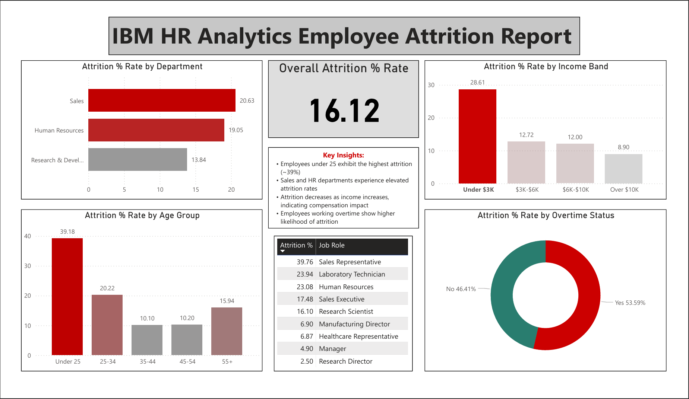

# HR Attrition Analysis

## Overview
Analyzed the IBM HR Analytics dataset (1,470 employees) using SQL (PostgreSQL) to identify key drivers of employee attrition. 
The analysis examines patterns across demographics, compensation, job roles, and workload to better understand employee turnover.
Findings were then visualized in a Power BI dashboard.

## Dashboard Visuals
- Overall attrition rate (KPI card)
- Attrition by department
- Attrition by age group
- Attrition by income band
- Attrition by job role
- Attrition by overtime

## Tools Used
- PostgreSQL — data storage and querying
- Power BI — dashboard and visualization
- Dataset: [IBM HR Analytics (Kaggle)](https://www.kaggle.com/datasets/pavansubhasht/ibm-hr-analytics-attrition-dataset)

## Key Findings
- Overall attrition rate is 16.12%, exceeding the industry average of 10–15%
- Sales (20.63%) and HR (19.05%) departments have the highest attrition
- Employees under 25 years of age leave at nearly 4x the rate of employees aged 35–44
- Employees earning under $3K/month leave at 3x the rate of those earning over $10K
- Employees in their first year leave at 34.88% vs 10.38% for 10+ year employees
- Overtime is the single strongest predictor at 30.53% vs 10.44% for non-overtime
- Sales Representatives have the highest role-level attrition at 39.76%
- Highest risk profile: Sales Rep + Overtime + 0–1 Years tenure + Under $3K = 87.5% attrition

## Recommendations
- Employee Retention: Implement a 6-month check-in program specifically for Sales Representatives to combat the 39.7% attrition rate.
- Overtime Audit: Review workload for the "Under 25" demographic, since the combination of high overtime and low tenure is the primary driver of turnover.
- Compensation Review: Evaluate the entry-level salary floor, as the "Under $3k" bracket is the most significant financial predictor of exit.

## Files
| File | Description |
|------|-------------|
| `hr_attrition_analysis.sql` | All 8 SQL queries with findings |
| `IBM Attrition Dashboard.pbix` | Power BI dashboard |
| `WA_Fn-UseC_-HR-Employee-Attrition.csv` | Source dataset |

